# Data Flow & Process Diagrams

This document visualizes how data and processes flow through your portfolio website, from user interactions to system responses.

## 🌊 Overall Data Flow Architecture

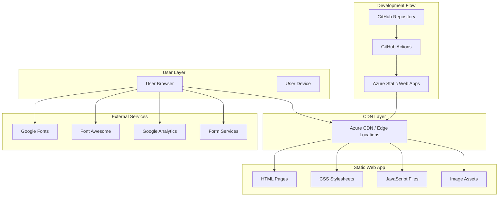
```mermaid
graph TB
    subgraph "User Layer"
        U[User Browser]
        D[User Device]
    end
    
    subgraph "CDN Layer"
        CDN[Azure CDN / Edge Locations]
    end
    
    subgraph "Static Web App"
        HTML[HTML Pages]
        CSS[CSS Stylesheets]
        JS[JavaScript Files]
        IMG[Image Assets]
    end
    
    subgraph "External Services"
        GF[Google Fonts]
        FA[Font Awesome]
        GA[Google Analytics]
        FS[Form Services]
    end
    
    subgraph "Development Flow"
        GH[GitHub Repository]
        GHA[GitHub Actions]
        AZ[Azure Static Web Apps]
    end
    
    U --> CDN
    CDN --> HTML
    CDN --> CSS
    CDN --> JS
    CDN --> IMG
    
    U --> GF
    U --> FA
    U --> GA
    U --> FS
    
    GH --> GHA
    GHA --> AZ
    AZ --> CDN
```

## 🔄 User Interaction Flow Diagrams

### 1. Initial Page Load Flow
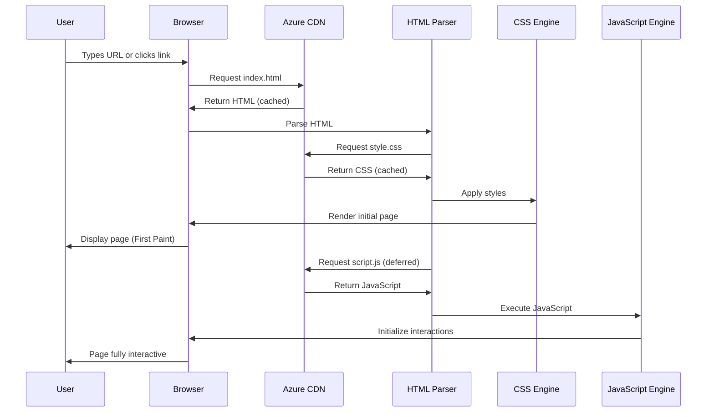
```mermaid
sequenceDiagram
    participant U as User
    participant B as Browser
    participant CDN as Azure CDN
    participant HTML as HTML Parser
    participant CSS as CSS Engine
    participant JS as JavaScript Engine
    
    U->>B: Types URL or clicks link
    B->>CDN: Request index.html
    CDN->>B: Return HTML (cached)
    B->>HTML: Parse HTML
    HTML->>CDN: Request style.css
    CDN->>HTML: Return CSS (cached)
    HTML->>CSS: Apply styles
    CSS->>B: Render initial page
    B->>U: Display page (First Paint)
    HTML->>CDN: Request script.js (deferred)
    CDN->>HTML: Return JavaScript
    HTML->>JS: Execute JavaScript
    JS->>B: Initialize interactions
    B->>U: Page fully interactive
```

### 2. Navigation Flow
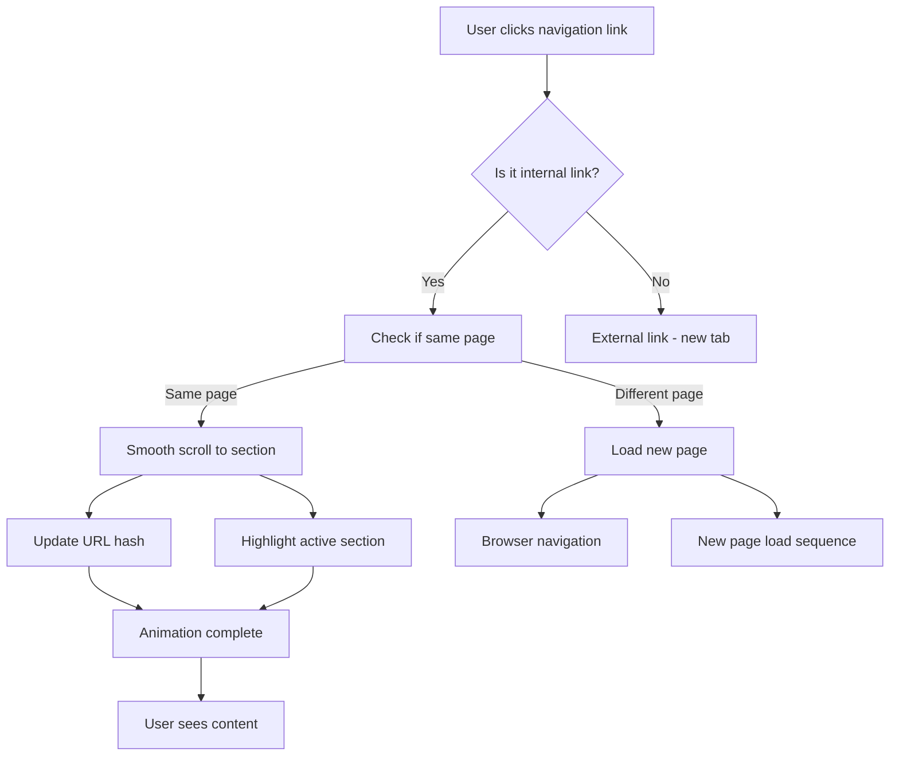
```mermaid
flowchart TD
    A[User clicks navigation link] --> B{Is it internal link?}
    B -->|Yes| C[Check if same page]
    B -->|No| D[External link - new tab]
    
    C -->|Same page| E[Smooth scroll to section]
    C -->|Different page| F[Load new page]
    
    E --> G[Update URL hash]
    E --> H[Highlight active section]
    
    F --> I[Browser navigation]
    F --> J[New page load sequence]
    
    G --> K[Animation complete]
    H --> K
    
    K --> L[User sees content]
```

### 3. Mobile Menu Interaction Flow
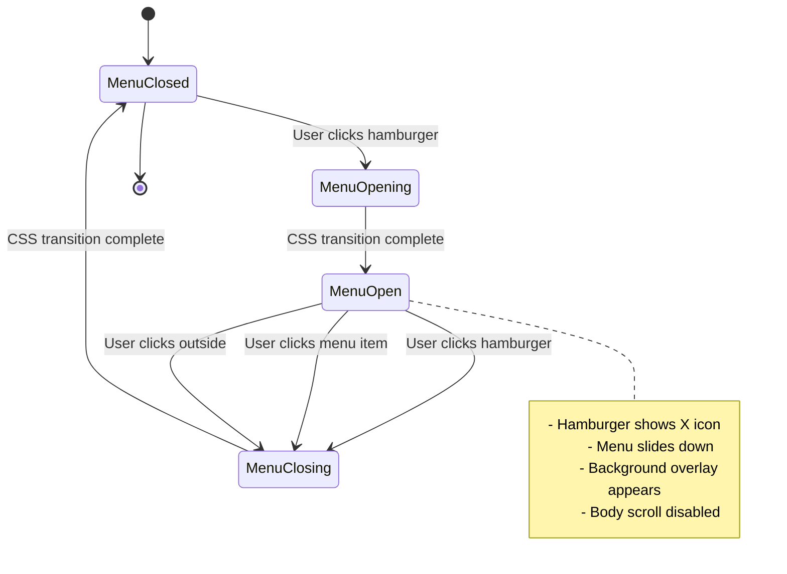
```mermaid
stateDiagram-v2
    [*] --> MenuClosed
    MenuClosed --> MenuOpening : User clicks hamburger
    MenuOpening --> MenuOpen : CSS transition complete
    MenuOpen --> MenuClosing : User clicks hamburger
    MenuOpen --> MenuClosing : User clicks menu item
    MenuOpen --> MenuClosing : User clicks outside
    MenuClosing --> MenuClosed : CSS transition complete
    MenuClosed --> [*]
    
    note right of MenuOpen
        - Hamburger shows X icon
        - Menu slides down
        - Background overlay appears
        - Body scroll disabled
    end note
```

## 📊 Content Rendering Flow

### Critical Rendering Path
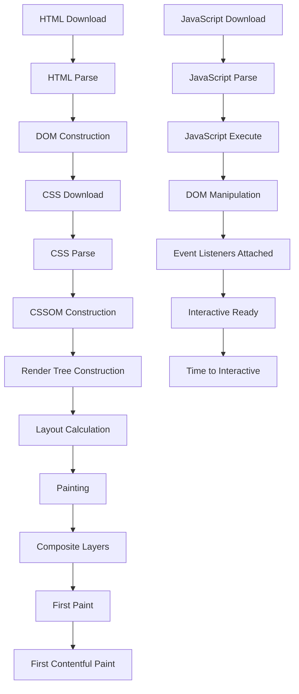
```mermaid
graph TD
    A[HTML Download] --> B[HTML Parse]
    B --> C[DOM Construction]
    C --> D[CSS Download]
    D --> E[CSS Parse]
    E --> F[CSSOM Construction]
    F --> G[Render Tree Construction]
    G --> H[Layout Calculation]
    H --> I[Painting]
    I --> J[Composite Layers]
    J --> K[First Paint]
    
    L[JavaScript Download] --> M[JavaScript Parse]
    M --> N[JavaScript Execute]
    N --> O[DOM Manipulation]
    O --> P[Event Listeners Attached]
    P --> Q[Interactive Ready]
    
    K --> R[First Contentful Paint]
    Q --> S[Time to Interactive]
```

### Image Loading Flow
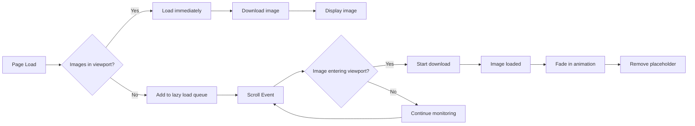
```mermaid
flowchart LR
    A[Page Load] --> B{Images in viewport?}
    B -->|Yes| C[Load immediately]
    B -->|No| D[Add to lazy load queue]
    
    C --> E[Download image]
    E --> F[Display image]
    
    D --> G[Scroll Event]
    G --> H{Image entering viewport?}
    H -->|Yes| I[Start download]
    H -->|No| J[Continue monitoring]
    
    I --> K[Image loaded]
    K --> L[Fade in animation]
    L --> M[Remove placeholder]
    
    J --> G
```

## 🎯 User Journey Data Flow

### Portfolio Visitor Journey
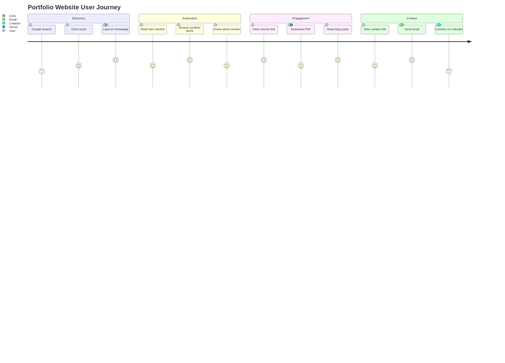
```mermaid
journey
    title Portfolio Website User Journey
    section Discovery
      Google Search: 3: User
      Click result: 4: User
      Land on homepage: 5: User, CDN
    section Exploration
      Read hero section: 4: User
      Browse portfolio items: 5: User
      Check about section: 4: User
    section Engagement
      Click resume link: 5: User
      Download PDF: 4: User, Server
      Read blog posts: 5: User
    section Contact
      View contact info: 4: User
      Send email: 5: User, Email
      Connect on LinkedIn: 3: User, LinkedIn
```

### Blog Reader Journey
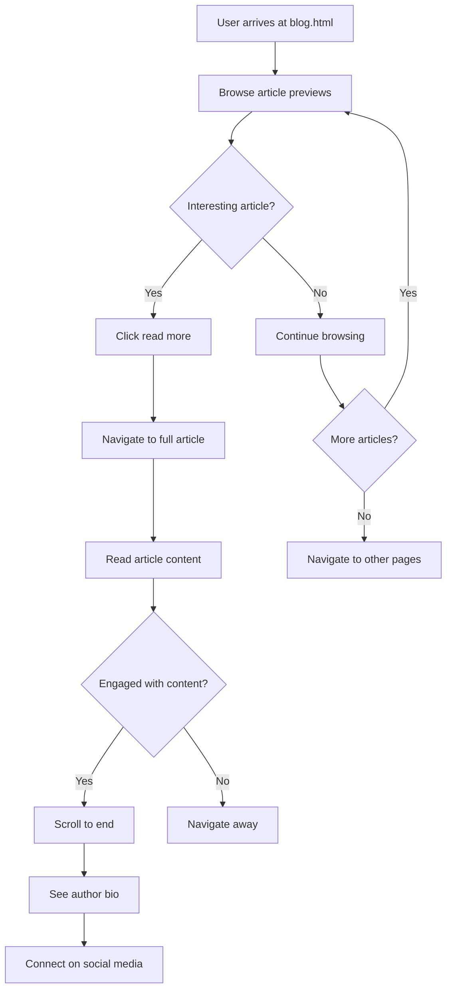
```mermaid
graph TD
    A[User arrives at blog.html] --> B[Browse article previews]
    B --> C{Interesting article?}
    C -->|Yes| D[Click read more]
    C -->|No| E[Continue browsing]
    
    D --> F[Navigate to full article]
    F --> G[Read article content]
    G --> H{Engaged with content?}
    
    H -->|Yes| I[Scroll to end]
    H -->|No| J[Navigate away]
    
    I --> K[See author bio]
    K --> L[Connect on social media]
    
    E --> M{More articles?}
    M -->|Yes| B
    M -->|No| N[Navigate to other pages]
```

## 🔧 Form Processing Flow

### Newsletter Signup Flow
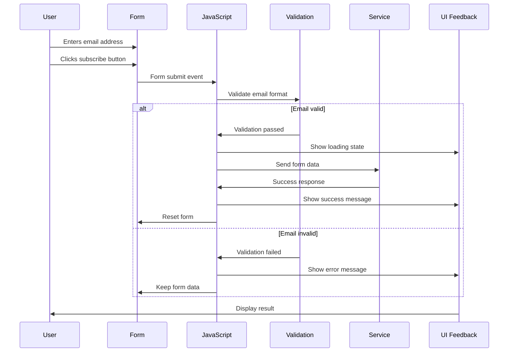
```mermaid
sequenceDiagram
    participant U as User
    participant F as Form
    participant JS as JavaScript
    participant V as Validation
    participant S as Service
    participant UI as UI Feedback
    
    U->>F: Enters email address
    U->>F: Clicks subscribe button
    F->>JS: Form submit event
    JS->>V: Validate email format
    
    alt Email valid
        V->>JS: Validation passed
        JS->>UI: Show loading state
        JS->>S: Send form data
        S->>JS: Success response
        JS->>UI: Show success message
        JS->>F: Reset form
    else Email invalid
        V->>JS: Validation failed
        JS->>UI: Show error message
        JS->>F: Keep form data
    end
    
    UI->>U: Display result
```

### Contact Form Flow (if implemented)
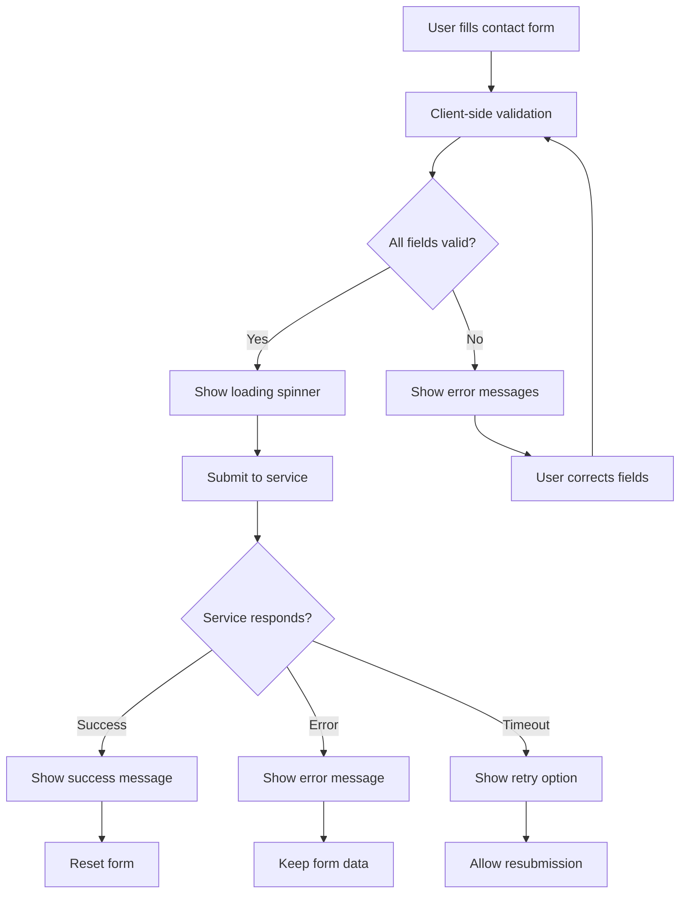
```mermaid
flowchart TD
    A[User fills contact form] --> B[Client-side validation]
    B --> C{All fields valid?}
    C -->|No| D[Show error messages]
    C -->|Yes| E[Show loading spinner]
    
    E --> F[Submit to service]
    F --> G{Service responds?}
    G -->|Success| H[Show success message]
    G -->|Error| I[Show error message]
    G -->|Timeout| J[Show retry option]
    
    H --> K[Reset form]
    I --> L[Keep form data]
    J --> M[Allow resubmission]
    
    D --> N[User corrects fields]
    N --> B
```

## 📱 Responsive Behavior Flow

### Screen Size Adaptation Flow
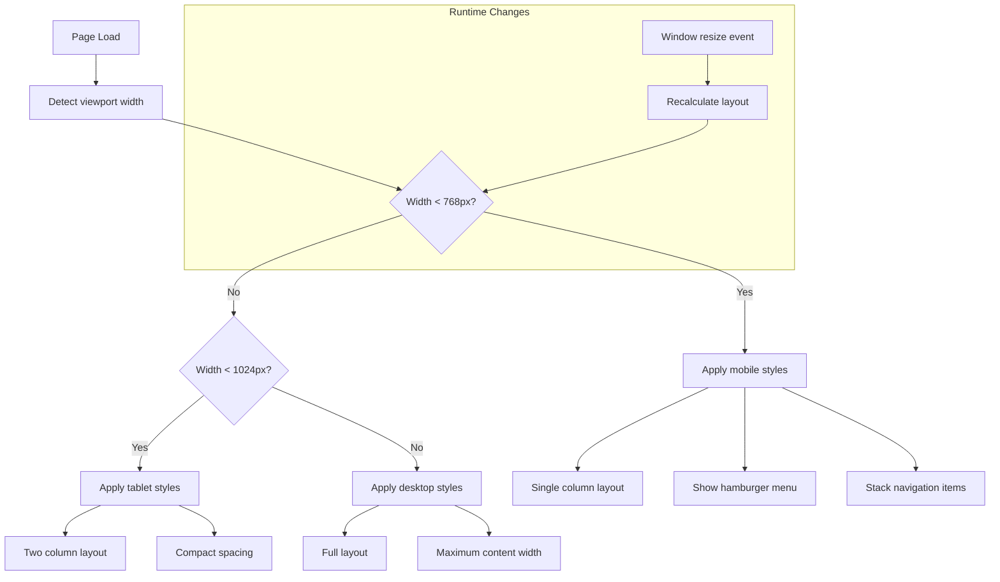
```mermaid
graph TD
    A[Page Load] --> B[Detect viewport width]
    B --> C{Width < 768px?}
    C -->|Yes| D[Apply mobile styles]
    C -->|No| E{Width < 1024px?}
    E -->|Yes| F[Apply tablet styles]
    E -->|No| G[Apply desktop styles]
    
    D --> H[Single column layout]
    D --> I[Show hamburger menu]
    D --> J[Stack navigation items]
    
    F --> K[Two column layout]
    F --> L[Compact spacing]
    
    G --> M[Full layout]
    G --> N[Maximum content width]
    
    subgraph "Runtime Changes"
        O[Window resize event] --> P[Recalculate layout]
        P --> C
    end
```

### Touch vs Mouse Interaction Flow
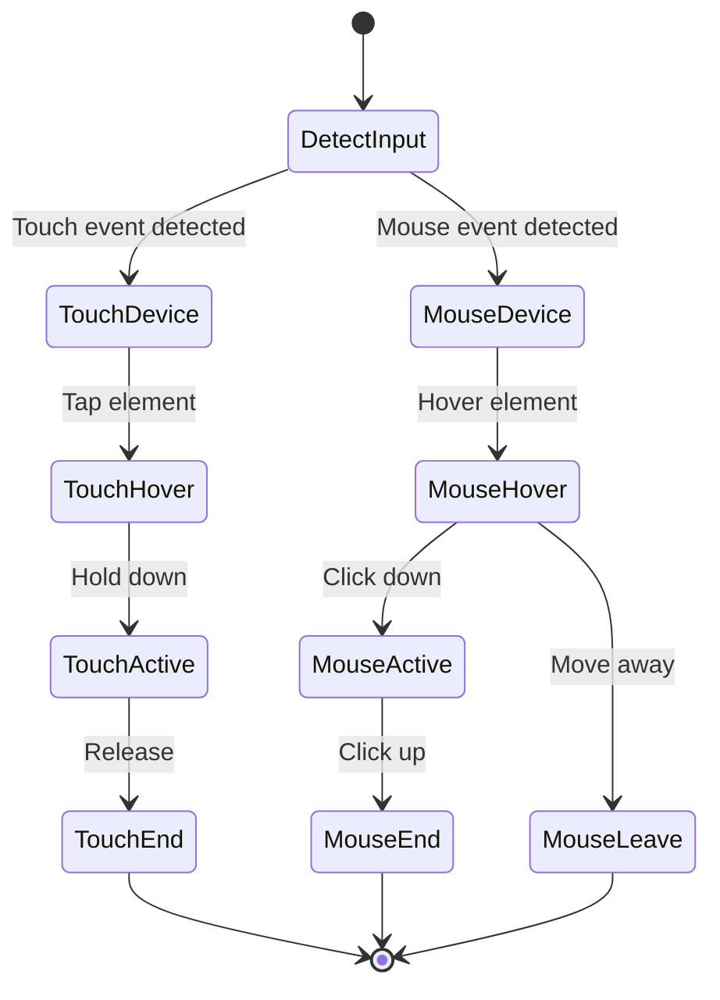
```mermaid
stateDiagram-v2
    [*] --> DetectInput
    DetectInput --> TouchDevice : Touch event detected
    DetectInput --> MouseDevice : Mouse event detected
    
    TouchDevice --> TouchHover : Tap element
    TouchHover --> TouchActive : Hold down
    TouchActive --> TouchEnd : Release
    
    MouseDevice --> MouseHover : Hover element
    MouseHover --> MouseActive : Click down
    MouseActive --> MouseEnd : Click up
    MouseHover --> MouseLeave : Move away
    
    TouchEnd --> [*]
    MouseEnd --> [*]
    MouseLeave --> [*]
```

## 🚀 Deployment Data Flow

### Development to Production Flow
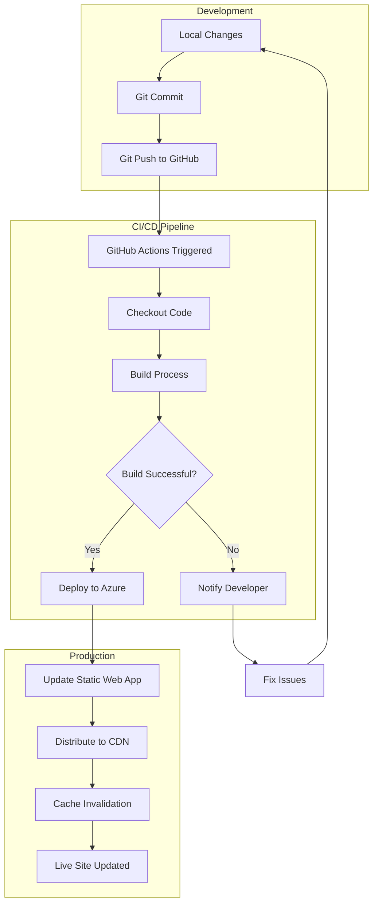
```mermaid
graph TD
    subgraph "Development"
        A[Local Changes] --> B[Git Commit]
        B --> C[Git Push to GitHub]
    end
    
    subgraph "CI/CD Pipeline"
        C --> D[GitHub Actions Triggered]
        D --> E[Checkout Code]
        E --> F[Build Process]
        F --> G{Build Successful?}
        G -->|Yes| H[Deploy to Azure]
        G -->|No| I[Notify Developer]
    end
    
    subgraph "Production"
        H --> J[Update Static Web App]
        J --> K[Distribute to CDN]
        K --> L[Cache Invalidation]
        L --> M[Live Site Updated]
    end
    
    I --> N[Fix Issues]
    N --> A
```

### Cache Management Flow
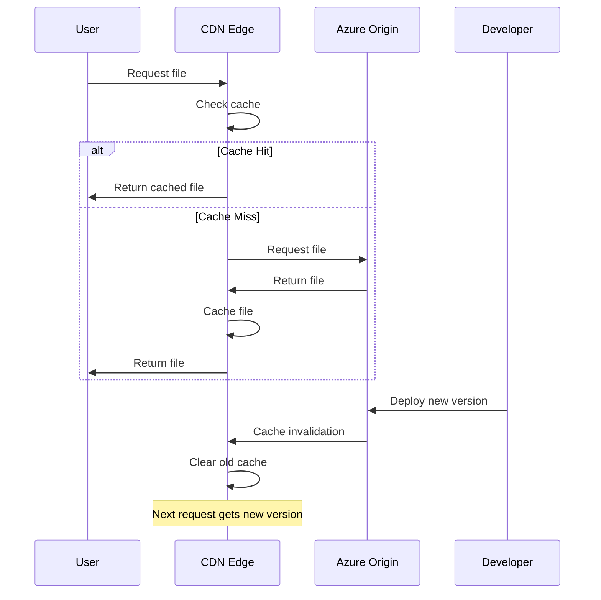
```mermaid
sequenceDiagram
    participant U as User
    participant CDN as CDN Edge
    participant Origin as Azure Origin
    participant Dev as Developer
    
    U->>CDN: Request file
    CDN->>CDN: Check cache
    
    alt Cache Hit
        CDN->>U: Return cached file
    else Cache Miss
        CDN->>Origin: Request file
        Origin->>CDN: Return file
        CDN->>CDN: Cache file
        CDN->>U: Return file
    end
    
    Dev->>Origin: Deploy new version
    Origin->>CDN: Cache invalidation
    CDN->>CDN: Clear old cache
    
    Note over CDN: Next request gets new version
```

## 📈 Performance Data Flow

### Page Speed Optimization Flow
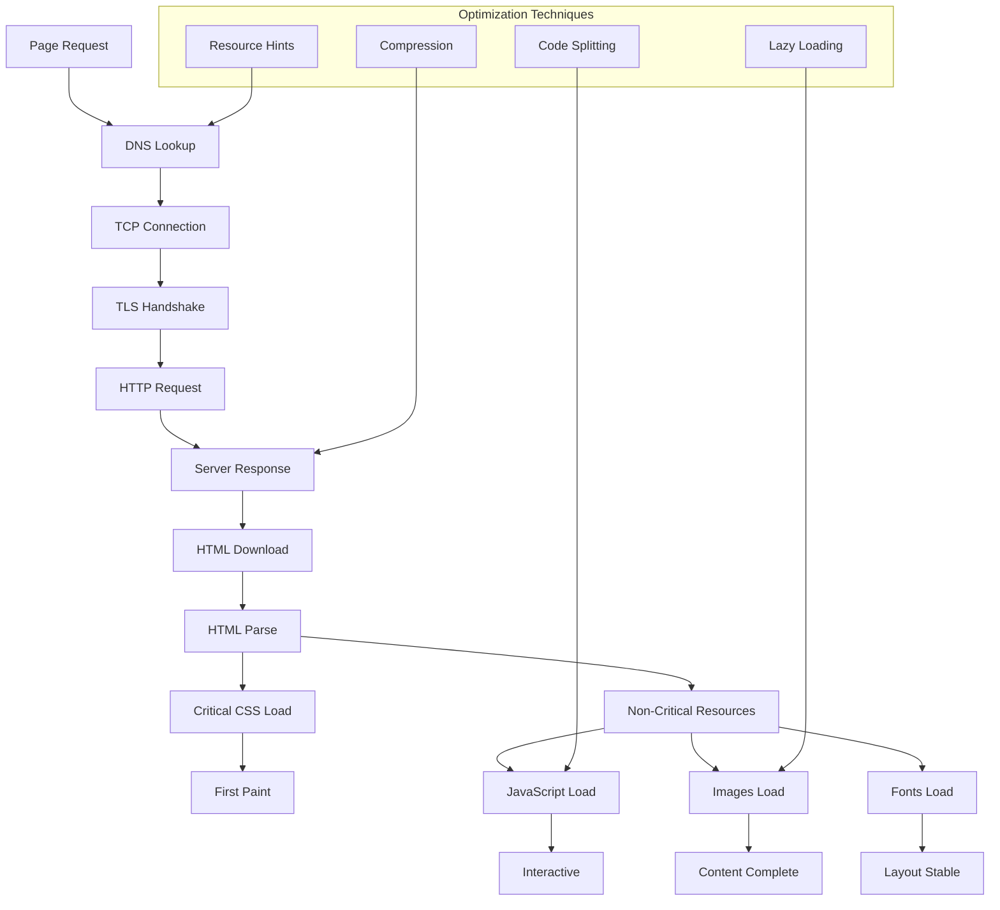
```mermaid
flowchart TD
    A[Page Request] --> B[DNS Lookup]
    B --> C[TCP Connection]
    C --> D[TLS Handshake]
    D --> E[HTTP Request]
    E --> F[Server Response]
    F --> G[HTML Download]
    G --> H[HTML Parse]
    
    H --> I[Critical CSS Load]
    I --> J[First Paint]
    
    H --> K[Non-Critical Resources]
    K --> L[JavaScript Load]
    K --> M[Images Load]
    K --> N[Fonts Load]
    
    L --> O[Interactive]
    M --> P[Content Complete]
    N --> Q[Layout Stable]
    
    subgraph "Optimization Techniques"
        R[Resource Hints]
        S[Lazy Loading]
        T[Code Splitting]
        U[Compression]
    end
    
    R --> B
    S --> M
    T --> L
    U --> F
```

### Error Handling Flow
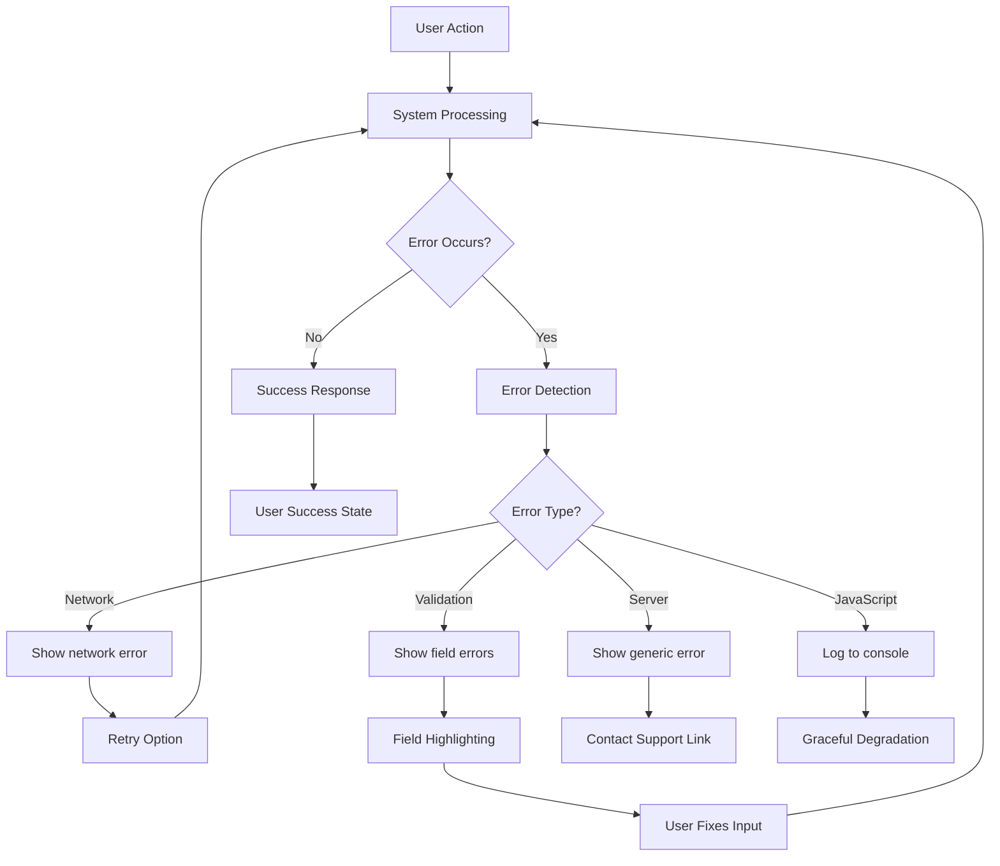
```mermaid
graph TD
    A[User Action] --> B[System Processing]
    B --> C{Error Occurs?}
    C -->|No| D[Success Response]
    C -->|Yes| E[Error Detection]
    
    E --> F{Error Type?}
    F -->|Network| G[Show network error]
    F -->|Validation| H[Show field errors]
    F -->|Server| I[Show generic error]
    F -->|JavaScript| J[Log to console]
    
    G --> K[Retry Option]
    H --> L[Field Highlighting]
    I --> M[Contact Support Link]
    J --> N[Graceful Degradation]
    
    K --> B
    L --> O[User Fixes Input]
    O --> B
    
    D --> P[User Success State]
```

## 🔍 Analytics Data Flow

### User Tracking Flow (if implemented)
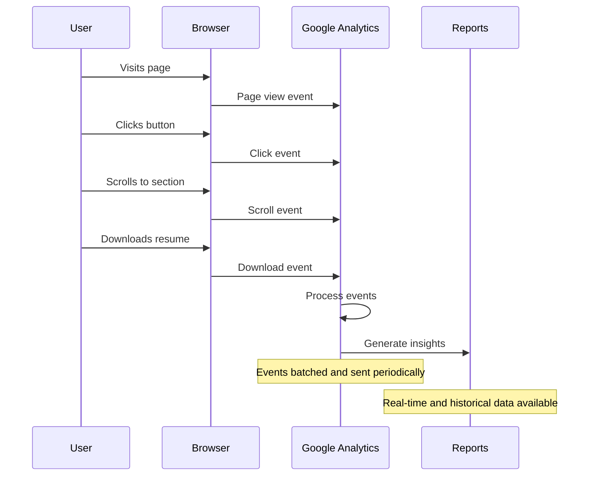
```mermaid
sequenceDiagram
    participant U as User
    participant B as Browser
    participant GA as Google Analytics
    participant R as Reports
    
    U->>B: Visits page
    B->>GA: Page view event
    U->>B: Clicks button
    B->>GA: Click event
    U->>B: Scrolls to section
    B->>GA: Scroll event
    U->>B: Downloads resume
    B->>GA: Download event
    
    GA->>GA: Process events
    GA->>R: Generate insights
    
    Note over GA: Events batched and sent periodically
    Note over R: Real-time and historical data available
```

---

These diagrams provide a comprehensive view of how data flows through your portfolio website, from initial user requests to final content delivery. Understanding these flows helps optimize performance and troubleshoot issues effectively.