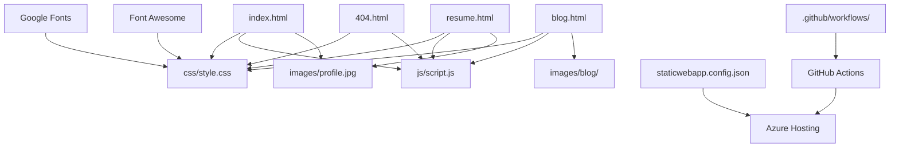

# File Dependencies & Relationships

This document maps out all file dependencies and relationships in your portfolio website, showing how components connect and depend on each other.

## 🔗 Dependency Graph Overview



## 📄 HTML File Dependencies

### `index.html` Dependencies
```html
<!-- External CDN Dependencies -->
<link href="https://fonts.googleapis.com/css2?family=Inter:wght@300;400;500;600;700&display=swap" rel="stylesheet">
<link href="https://cdnjs.cloudflare.com/ajax/libs/font-awesome/6.0.0/css/all.min.css" rel="stylesheet">

<!-- Local File Dependencies -->
<link rel="stylesheet" href="css/style.css">           <!-- CRITICAL DEPENDENCY -->
<script src="js/script.js"></script>                   <!-- CRITICAL DEPENDENCY -->

<!-- Asset Dependencies -->
           <!-- OPTIONAL - has fallback -->
 <!-- OPTIONAL - has fallback -->
```

**Dependency Analysis:**
- **Critical Path**: `style.css` (blocks rendering)
- **Enhancement**: `script.js` (deferred, non-blocking)
- **Progressive**: Images (lazy-loaded with placeholders)
- **External**: Fonts and icons (cached, fallbacks available)

### `resume.html` Dependencies
```html
<!-- Inherits all dependencies from index.html -->
<!-- Additional specific dependencies -->
<div class="profile-photo">
          <!-- REQUIRED for professional look -->
</div>

<!-- PDF Download Link (optional) -->
<a href="documents/resume.pdf" class="download-btn">    <!-- OPTIONAL - can be external link -->
```

### `blog.html` Dependencies
```html
<!-- Inherits base dependencies -->
<!-- Blog-specific image dependencies -->
      <!-- OPTIONAL - has placeholders -->
      <!-- OPTIONAL - has placeholders -->

<!-- Individual blog post links -->
<a href="blog/design-systems-guide.html">              <!-- OPTIONAL - can be external -->
```

### Individual Blog Posts (`blog/*.html`)
```html
<!-- Relative path dependencies -->
<link rel="stylesheet" href="../css/style.css">        <!-- CRITICAL - relative path -->
<script src="../js/script.js"></script>                <!-- CRITICAL - relative path -->
 <!-- OPTIONAL -->

<!-- Navigation links -->
<a href="../index.html">Home</a>                       <!-- CRITICAL - site navigation -->
<a href="../blog.html">← Back to Blog</a>              <!-- CRITICAL - navigation -->
```

## 🎨 CSS Dependencies

### `css/style.css` Dependencies
```css
/* External Font Dependencies */
@import url('https://fonts.googleapis.com/css2?family=Inter...');  /* OPTIONAL - fallback available */

/* CSS Custom Properties (Internal Dependencies) */
:root {
    --primary-color: #2563eb;                           /* REFERENCED throughout file */
    --font-family: 'Inter', system-ui, sans-serif;     /* REFERENCED throughout file */
    --container-max-width: 1200px;                     /* REFERENCED in layout */
}

/* Internal Class Dependencies */
.btn {                                                  /* BASE class */
    /* base button styles */
}

.btn-primary {                                          /* EXTENDS .btn */
    background-color: var(--primary-color);            /* DEPENDS ON CSS variable */
}

.btn-secondary {                                        /* EXTENDS .btn */
    color: var(--primary-color);                       /* DEPENDS ON CSS variable */
    border: 2px solid var(--primary-color);            /* DEPENDS ON CSS variable */
}
```

**CSS Dependency Chain:**
```
CSS Variables (--primary-color)
    ↓
Base Components (.btn, .container)
    ↓
Component Variants (.btn-primary, .work-item)
    ↓
Layout Components (.hero-container, .resume-grid)
    ↓
Page-Specific Styles (.blog-post, .resume-left)
    ↓
Responsive Overrides (@media queries)
```

## ⚡ JavaScript Dependencies

### `js/script.js` Dependencies
```javascript
// DOM Element Dependencies
const hamburger = document.getElementById('hamburger');     // DEPENDS ON: HTML element with ID
const navMenu = document.getElementById('nav-menu');        // DEPENDS ON: HTML element with ID

// CSS Class Dependencies  
navMenu.classList.toggle('active');                        // DEPENDS ON: .active class in CSS

// Browser API Dependencies
window.addEventListener('scroll', function() {             // DEPENDS ON: Window object
    if (window.scrollY > 50) {                            // DEPENDS ON: scroll position
        navbar.style.background = 'rgba(255,255,255,0.98)'; // DEPENDS ON: element existence
    }
});

// Intersection Observer API
const observer = new IntersectionObserver(callback, options); // DEPENDS ON: Modern browser support
```

**JavaScript Dependency Requirements:**
- **DOM Elements**: All JavaScript functions depend on specific HTML elements existing
- **CSS Classes**: JavaScript toggles CSS classes that must be defined
- **Browser APIs**: Uses modern APIs with graceful degradation
- **Event Handling**: Depends on user interactions and browser events

## 🖼️ Asset Dependencies

### Image Dependency Matrix
```
HTML File          | Required Images    | Optional Images      | Fallback Strategy
-------------------|-------------------|----------------------|------------------
index.html         | None              | profile.jpg          | Placeholder div
                   |                   | projects/*.jpg       | Icon placeholders
resume.html        | profile.jpg       | None                 | Placeholder div
blog.html          | None              | blog/*.jpg           | Icon placeholders
blog/*.html        | None              | featured images      | No image shown
```

### Font Dependencies
```
Primary Font: 'Inter' from Google Fonts
    ↓ (if fails)
Fallback 1: system-ui (system default)
    ↓ (if fails)  
Fallback 2: -apple-system (macOS/iOS)
    ↓ (if fails)
Fallback 3: sans-serif (browser default)
```

## 🔧 Configuration File Dependencies

### `staticwebapp.config.json` Dependencies
```json
{
  "routes": [
    {
      "route": "/*",
      "serve": "/index.html"          // DEPENDS ON: index.html existing
    }
  ],
  "responseOverrides": {
    "404": {
      "rewrite": "/404.html"          // DEPENDS ON: 404.html existing
    }
  }
}
```

### GitHub Actions Dependencies
```yaml
# .github/workflows/azure-static-web-apps.yml
steps:
  - uses: actions/checkout@v3         # DEPENDS ON: GitHub repository
  - uses: Azure/static-web-apps-deploy@v1  # DEPENDS ON: Azure service
    with:
      azure_static_web_apps_api_token: ${{ secrets.TOKEN }}  # DEPENDS ON: GitHub secrets
      app_location: "/"               # DEPENDS ON: Files in root directory
```

## 🌐 External Dependencies

### CDN Dependencies
```html
<!-- Google Fonts -->
<link href="https://fonts.googleapis.com/css2?family=Inter..." rel="stylesheet">
Status: OPTIONAL - Has fallback fonts
Risk: Low - Google Fonts is highly reliable
Fallback: system-ui, -apple-system, sans-serif

<!-- Font Awesome Icons -->  
<link href="https://cdnjs.cloudflare.com/ajax/libs/font-awesome/6.0.0/css/all.min.css" rel="stylesheet">
Status: OPTIONAL - Icons enhance UX but not critical
Risk: Low - Cloudflare CDN is reliable
Fallback: Unicode symbols or text labels
```

### Third-Party Service Dependencies
```javascript
// Newsletter Form (Optional)
<form action="https://formspree.io/f/your-form-id" method="POST">
Status: OPTIONAL - Only if contact form is implemented
Risk: Medium - Depends on external service
Fallback: mailto: links or contact information display

// Google Analytics (Optional)
gtag('config', 'GA_MEASUREMENT_ID');
Status: OPTIONAL - For tracking only
Risk: Low - Analytics failure doesn't affect site function
Fallback: No analytics data collected
```

## 🔄 Circular Dependencies Check

### ✅ No Circular Dependencies Found
```
index.html → style.css ✓ (One-way)
index.html → script.js ✓ (One-way)
style.css → Google Fonts ✓ (One-way)
script.js → DOM elements ✓ (One-way)
```

### Potential Circular Dependency Risks
```
❌ AVOID: script.js modifying href attributes that point back to same page
❌ AVOID: CSS imports that reference each other
❌ AVOID: JavaScript modules that import each other
```

## 📊 Dependency Load Order

### Critical Rendering Path
```
1. HTML (index.html)                  # 0ms - Immediate
   ↓
2. CSS (style.css)                    # 0-50ms - Render blocking
   ↓  
3. Google Fonts                       # 50-200ms - Render blocking
   ↓
4. Initial Page Render                # 200-500ms - First paint
   ↓
5. JavaScript (script.js)             # 500-800ms - Non-blocking
   ↓
6. Font Awesome Icons                 # 800-1000ms - Non-blocking
   ↓
7. Images (lazy loaded)               # 1000ms+ - Progressive
```

### Optimization Strategy
```
Preload Critical Resources:
<link rel="preload" href="css/style.css" as="style">
<link rel="preload" href="https://fonts.googleapis.com/css2..." as="style">

Defer Non-Critical Resources:
<script src="js/script.js" defer></script>
<link rel="stylesheet" href="font-awesome.css" media="print" onload="this.media='all'">

Lazy Load Assets:

```

## 🛡️ Dependency Failure Handling

### CSS Failure Recovery
```css
/* If Google Fonts fails */
font-family: 'Inter', system-ui, -apple-system, BlinkMacSystemFont, sans-serif;

/* If CSS variables fail */
background-color: var(--primary-color, #2563eb);  /* Fallback value */

/* If custom fonts fail */
@font-face {
  font-family: 'Inter';
  src: url('fonts/inter.woff2') format('woff2');
  font-display: swap;  /* Show fallback font immediately */
}
```

### JavaScript Failure Recovery
```javascript
// Check if required elements exist
if (hamburger && navMenu) {
  // Mobile menu functionality
} else {
  console.warn('Mobile menu elements not found');
}

// Feature detection
if ('IntersectionObserver' in window) {
  // Use Intersection Observer for scroll animations
} else {
  // Fallback: show all elements immediately
  document.querySelectorAll('.animate-element').forEach(el => {
    el.style.opacity = '1';
  });
}
```

### Image Failure Recovery
```html
<!-- Image with fallback -->

<div class="profile-placeholder" style="display: none;">
  <i class="fas fa-user"></i>
</div>
```

## 📈 Dependency Monitoring

### Health Checks
```javascript
// Monitor external dependencies
const healthCheck = {
  googleFonts: document.fonts.check('16px Inter'),
  fontAwesome: !!document.querySelector('.fas'),
  criticalCSS: !!getComputedStyle(document.body).getPropertyValue('--primary-color')
};

console.log('Dependency Health:', healthCheck);
```

### Performance Monitoring
```javascript
// Track dependency load times
window.addEventListener('load', () => {
  const perfData = performance.getEntriesByType('navigation')[0];
  console.log('CSS Load Time:', perfData.responseEnd - perfData.requestStart);
});
```

---

This dependency analysis ensures you understand how every component relies on others, helping you make informed decisions about modifications and troubleshoot issues effectively. The modular architecture minimizes dependencies while maintaining functionality.