# Sequence Diagrams & User Interactions

This document provides detailed sequence diagrams showing the chronological order of interactions between users, browsers, and system components in your portfolio website.

## 🚀 Page Load Sequence Diagrams

### Complete Page Load Sequence
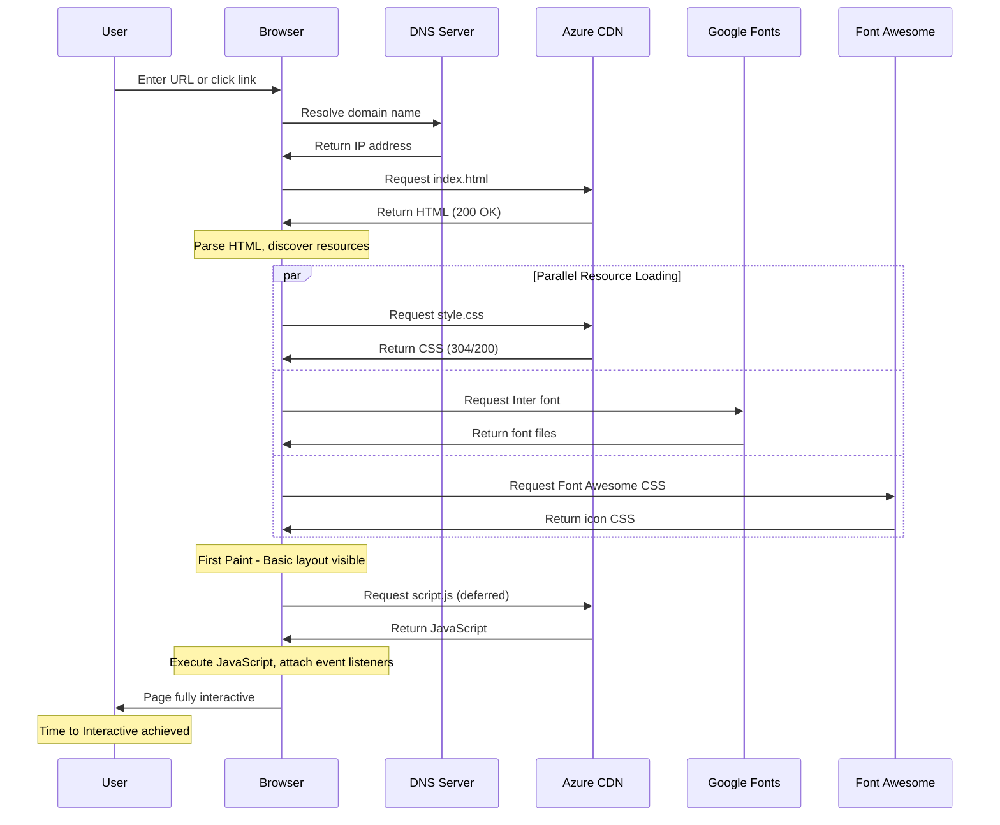
```mermaid
sequenceDiagram
    participant U as User
    participant B as Browser
    participant DNS as DNS Server
    participant CDN as Azure CDN
    participant GF as Google Fonts
    participant FA as Font Awesome
    
    U->>B: Enter URL or click link
    B->>DNS: Resolve domain name
    DNS->>B: Return IP address
    
    B->>CDN: Request index.html
    CDN->>B: Return HTML (200 OK)
    
    Note over B: Parse HTML, discover resources
    
    par Parallel Resource Loading
        B->>CDN: Request style.css
        CDN->>B: Return CSS (304/200)
    and
        B->>GF: Request Inter font
        GF->>B: Return font files
    and
        B->>FA: Request Font Awesome CSS
        FA->>B: Return icon CSS
    end
    
    Note over B: First Paint - Basic layout visible
    
    B->>CDN: Request script.js (deferred)
    CDN->>B: Return JavaScript
    
    Note over B: Execute JavaScript, attach event listeners
    
    B->>U: Page fully interactive
    
    Note over U: Time to Interactive achieved
```

### Mobile Page Load Sequence
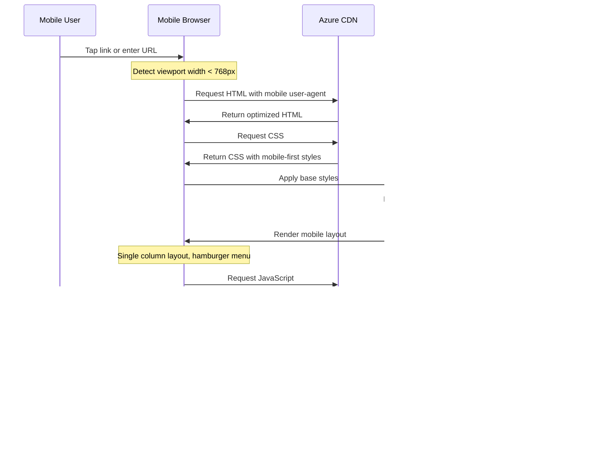
```mermaid
sequenceDiagram
    participant U as Mobile User
    participant B as Mobile Browser
    participant CDN as Azure CDN
    participant CSS as CSS Engine
    participant JS as JavaScript Engine
    
    U->>B: Tap link or enter URL
    Note over B: Detect viewport width < 768px
    
    B->>CDN: Request HTML with mobile user-agent
    CDN->>B: Return optimized HTML
    
    B->>CDN: Request CSS
    CDN->>B: Return CSS with mobile-first styles
    
    B->>CSS: Apply base styles
    CSS->>CSS: Process mobile media queries
    CSS->>B: Render mobile layout
    
    Note over B: Single column layout, hamburger menu
    
    B->>CDN: Request JavaScript
    CDN->>B: Return interactive enhancements
    
    B->>JS: Initialize mobile-specific features
    JS->>JS: Setup touch event handlers
    JS->>JS: Initialize mobile menu
    
    B->>U: Mobile-optimized page ready
```

## 🧭 Navigation Sequence Diagrams

### Internal Navigation Sequence
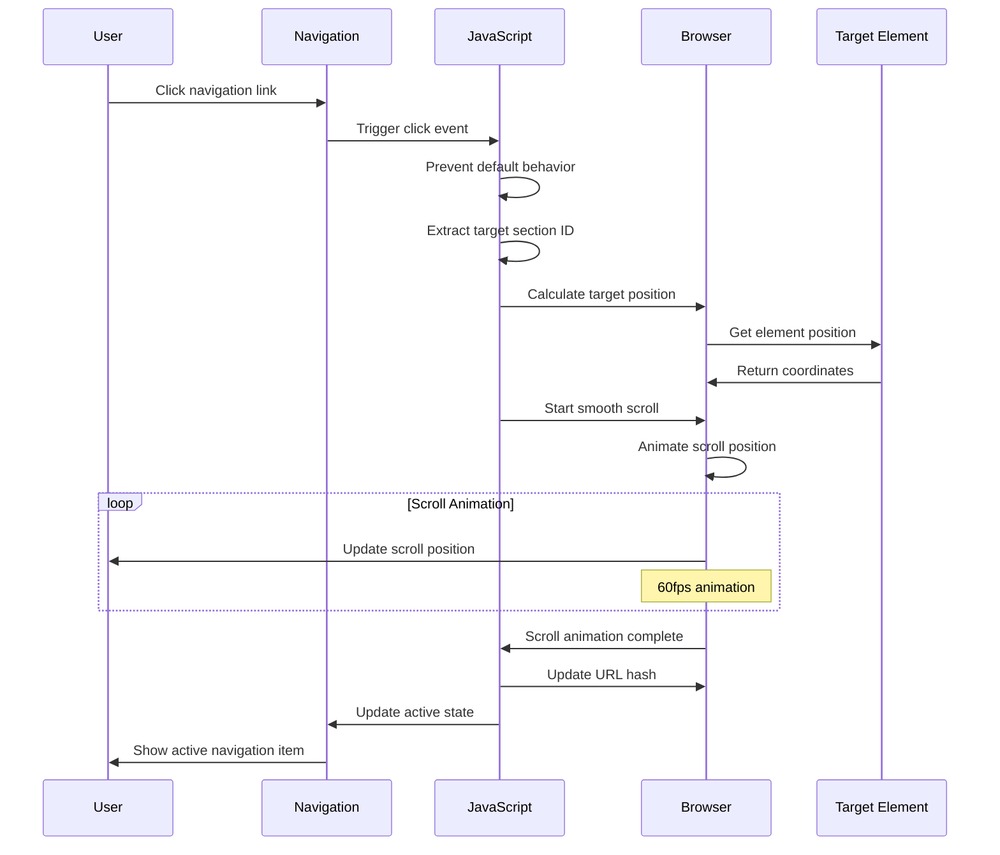
```mermaid
sequenceDiagram
    participant U as User
    participant Nav as Navigation
    participant JS as JavaScript
    participant Browser as Browser
    participant Elem as Target Element
    
    U->>Nav: Click navigation link
    Nav->>JS: Trigger click event
    JS->>JS: Prevent default behavior
    JS->>JS: Extract target section ID
    
    JS->>Browser: Calculate target position
    Browser->>Elem: Get element position
    Elem->>Browser: Return coordinates
    
    JS->>Browser: Start smooth scroll
    Browser->>Browser: Animate scroll position
    
    loop Scroll Animation
        Browser->>U: Update scroll position
        Note over Browser: 60fps animation
    end
    
    Browser->>JS: Scroll animation complete
    JS->>Browser: Update URL hash
    JS->>Nav: Update active state
    Nav->>U: Show active navigation item
```

### Mobile Menu Toggle Sequence
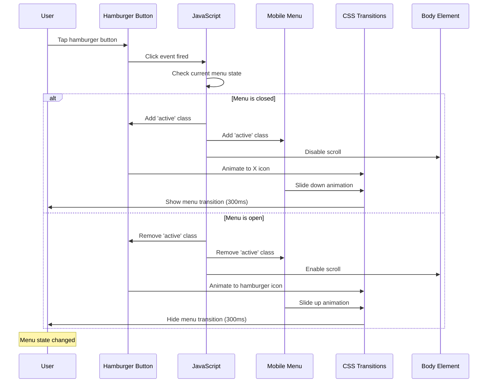
```mermaid
sequenceDiagram
    participant U as User
    participant Hamburger as Hamburger Button
    participant JS as JavaScript
    participant Menu as Mobile Menu
    participant CSS as CSS Transitions
    participant Body as Body Element
    
    U->>Hamburger: Tap hamburger button
    Hamburger->>JS: Click event fired
    
    JS->>JS: Check current menu state
    
    alt Menu is closed
        JS->>Hamburger: Add 'active' class
        JS->>Menu: Add 'active' class
        JS->>Body: Disable scroll
        
        Hamburger->>CSS: Animate to X icon
        Menu->>CSS: Slide down animation
        CSS->>U: Show menu transition (300ms)
        
    else Menu is open
        JS->>Hamburger: Remove 'active' class
        JS->>Menu: Remove 'active' class
        JS->>Body: Enable scroll
        
        Hamburger->>CSS: Animate to hamburger icon
        Menu->>CSS: Slide up animation
        CSS->>U: Hide menu transition (300ms)
    end
    
    Note over U: Menu state changed
```

## 📝 Form Interaction Sequences

### Newsletter Signup Sequence
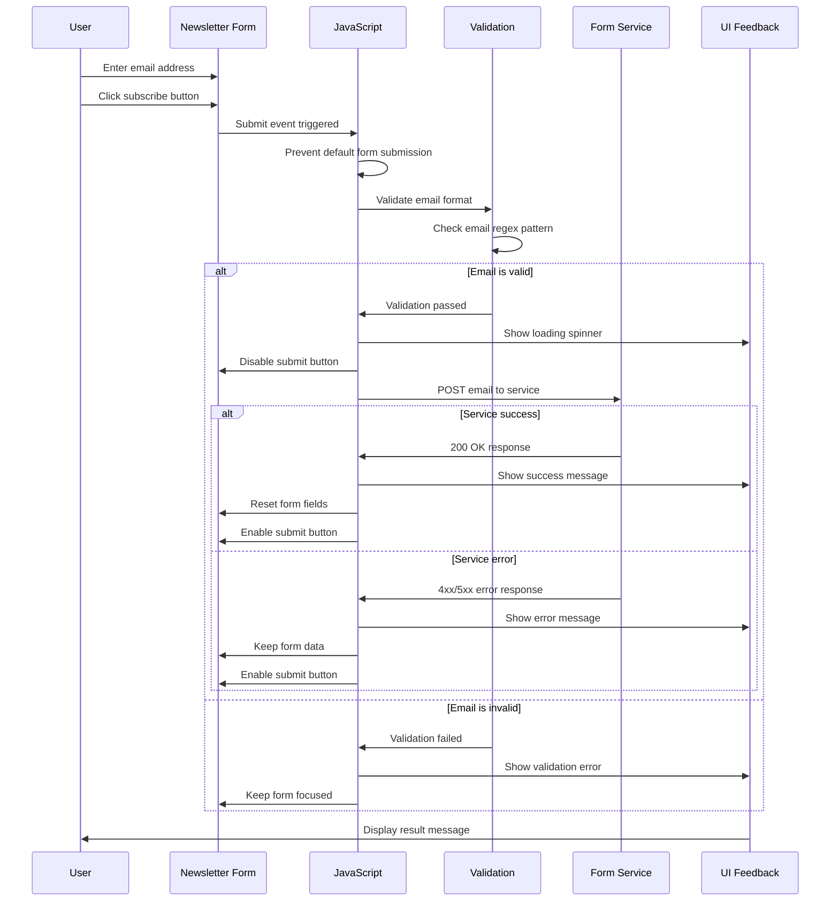
```mermaid
sequenceDiagram
    participant U as User
    participant Form as Newsletter Form
    participant JS as JavaScript
    participant Valid as Validation
    participant API as Form Service
    participant UI as UI Feedback
    
    U->>Form: Enter email address
    U->>Form: Click subscribe button
    
    Form->>JS: Submit event triggered
    JS->>JS: Prevent default form submission
    
    JS->>Valid: Validate email format
    Valid->>Valid: Check email regex pattern
    
    alt Email is valid
        Valid->>JS: Validation passed
        JS->>UI: Show loading spinner
        JS->>Form: Disable submit button
        
        JS->>API: POST email to service
        
        alt Service success
            API->>JS: 200 OK response
            JS->>UI: Show success message
            JS->>Form: Reset form fields
            JS->>Form: Enable submit button
            
        else Service error
            API->>JS: 4xx/5xx error response
            JS->>UI: Show error message
            JS->>Form: Keep form data
            JS->>Form: Enable submit button
        end
        
    else Email is invalid
        Valid->>JS: Validation failed
        JS->>UI: Show validation error
        JS->>Form: Keep form focused
    end
    
    UI->>U: Display result message
```

### Contact Form Sequence (Extended)
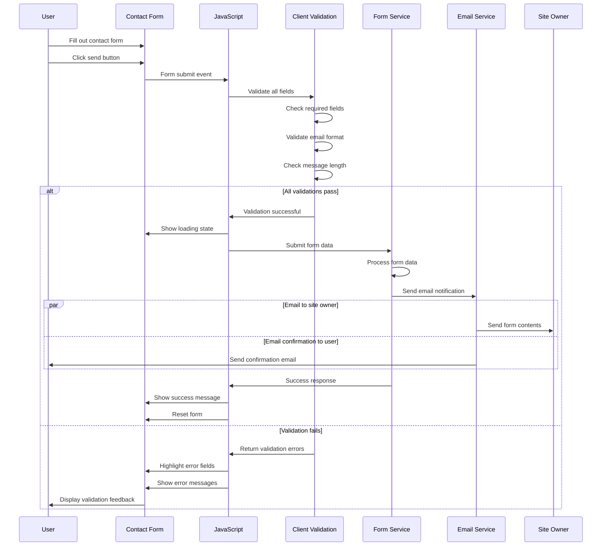
```mermaid
sequenceDiagram
    participant U as User
    participant F as Contact Form
    participant JS as JavaScript
    participant V as Client Validation
    participant S as Form Service
    participant E as Email Service
    participant Owner as Site Owner
    
    U->>F: Fill out contact form
    U->>F: Click send button
    
    F->>JS: Form submit event
    JS->>V: Validate all fields
    
    V->>V: Check required fields
    V->>V: Validate email format
    V->>V: Check message length
    
    alt All validations pass
        V->>JS: Validation successful
        JS->>F: Show loading state
        
        JS->>S: Submit form data
        S->>S: Process form data
        S->>E: Send email notification
        
        par Email to site owner
            E->>Owner: Send form contents
        and Email confirmation to user
            E->>U: Send confirmation email
        end
        
        S->>JS: Success response
        JS->>F: Show success message
        JS->>F: Reset form
        
    else Validation fails
        V->>JS: Return validation errors
        JS->>F: Highlight error fields
        JS->>F: Show error messages
        F->>U: Display validation feedback
    end
```

## 🎨 Interactive Element Sequences

### Hover Effect Sequence
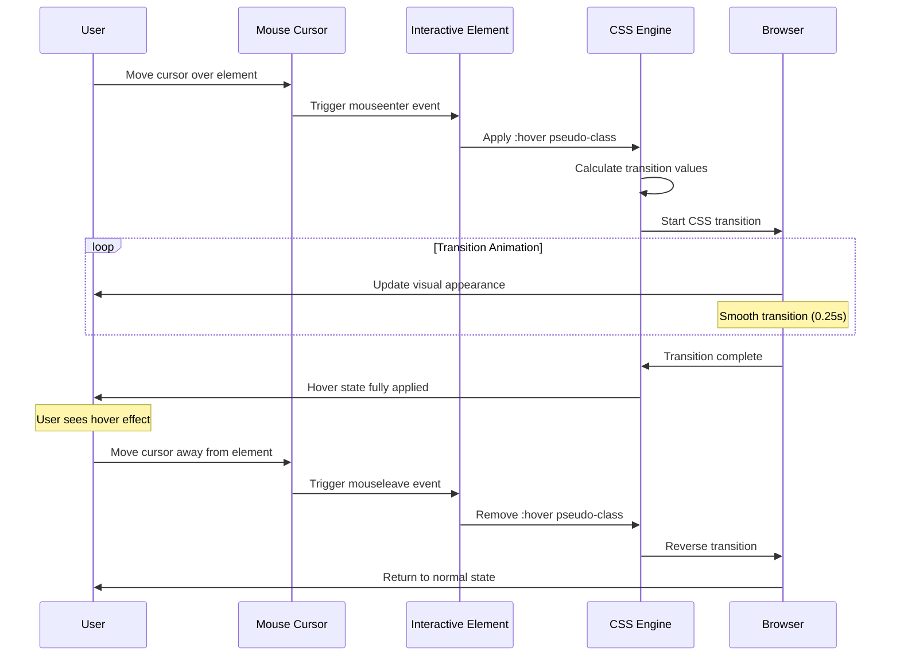
```mermaid
sequenceDiagram
    participant U as User
    participant Mouse as Mouse Cursor
    participant Elem as Interactive Element
    participant CSS as CSS Engine
    participant Browser as Browser
    
    U->>Mouse: Move cursor over element
    Mouse->>Elem: Trigger mouseenter event
    Elem->>CSS: Apply :hover pseudo-class
    
    CSS->>CSS: Calculate transition values
    CSS->>Browser: Start CSS transition
    
    loop Transition Animation
        Browser->>U: Update visual appearance
        Note over Browser: Smooth transition (0.25s)
    end
    
    Browser->>CSS: Transition complete
    CSS->>U: Hover state fully applied
    
    Note over U: User sees hover effect
    
    U->>Mouse: Move cursor away from element
    Mouse->>Elem: Trigger mouseleave event
    Elem->>CSS: Remove :hover pseudo-class
    
    CSS->>Browser: Reverse transition
    Browser->>U: Return to normal state
```

### Button Click Sequence
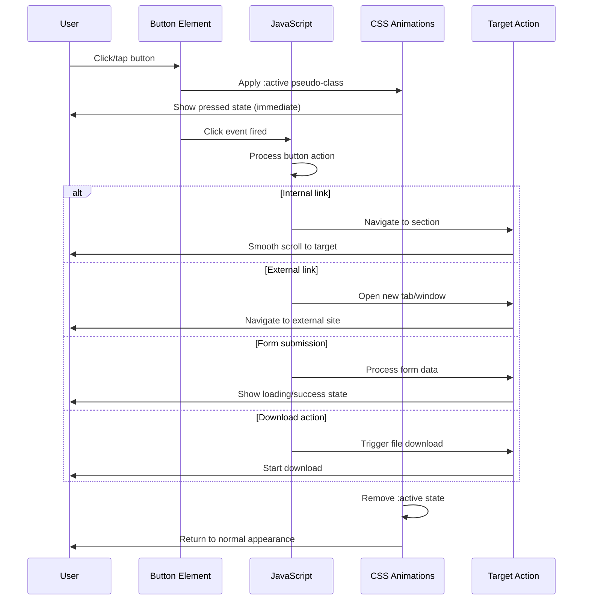
```mermaid
sequenceDiagram
    participant U as User
    participant Btn as Button Element
    participant JS as JavaScript
    participant CSS as CSS Animations
    participant Action as Target Action
    
    U->>Btn: Click/tap button
    Btn->>CSS: Apply :active pseudo-class
    CSS->>U: Show pressed state (immediate)
    
    Btn->>JS: Click event fired
    JS->>JS: Process button action
    
    alt Internal link
        JS->>Action: Navigate to section
        Action->>U: Smooth scroll to target
        
    else External link
        JS->>Action: Open new tab/window
        Action->>U: Navigate to external site
        
    else Form submission
        JS->>Action: Process form data
        Action->>U: Show loading/success state
        
    else Download action
        JS->>Action: Trigger file download
        Action->>U: Start download
    end
    
    CSS->>CSS: Remove :active state
    CSS->>U: Return to normal appearance
```

## 📱 Touch Interaction Sequences

### Touch Navigation Sequence
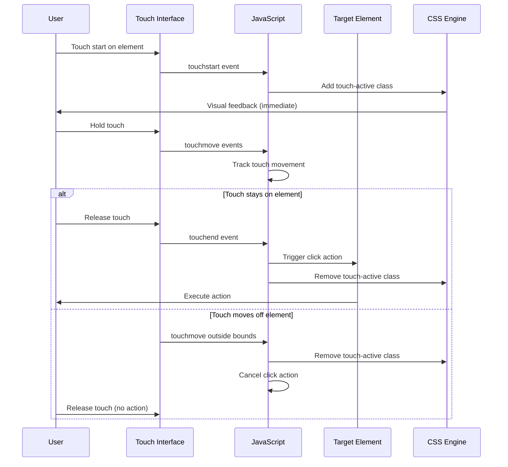
```mermaid
sequenceDiagram
    participant U as User
    participant Touch as Touch Interface
    participant JS as JavaScript
    participant Elem as Target Element
    participant CSS as CSS Engine
    
    U->>Touch: Touch start on element
    Touch->>JS: touchstart event
    JS->>CSS: Add touch-active class
    CSS->>U: Visual feedback (immediate)
    
    U->>Touch: Hold touch
    Touch->>JS: touchmove events
    JS->>JS: Track touch movement
    
    alt Touch stays on element
        U->>Touch: Release touch
        Touch->>JS: touchend event
        JS->>Elem: Trigger click action
        JS->>CSS: Remove touch-active class
        Elem->>U: Execute action
        
    else Touch moves off element
        Touch->>JS: touchmove outside bounds
        JS->>CSS: Remove touch-active class
        JS->>JS: Cancel click action
        U->>Touch: Release touch (no action)
    end
```

### Swipe Gesture Sequence (if implemented)
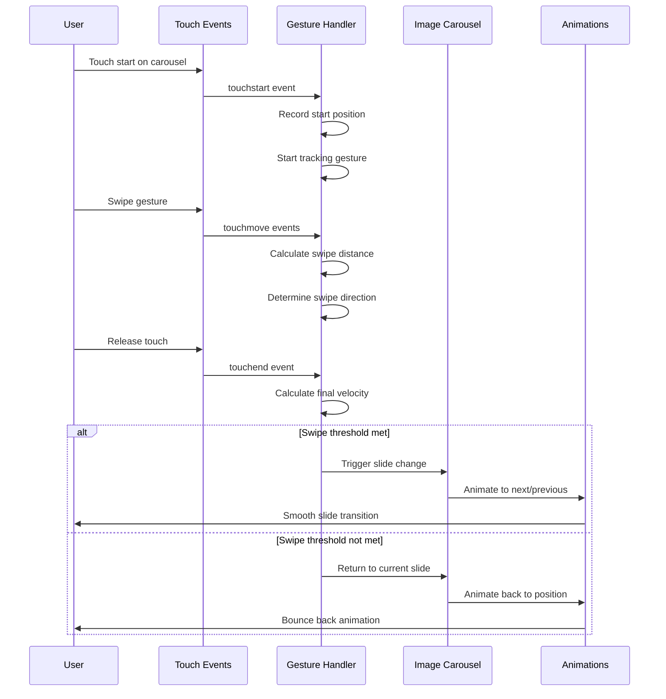
```mermaid
sequenceDiagram
    participant U as User
    participant Touch as Touch Events
    participant JS as Gesture Handler
    participant Carousel as Image Carousel
    participant CSS as Animations
    
    U->>Touch: Touch start on carousel
    Touch->>JS: touchstart event
    JS->>JS: Record start position
    JS->>JS: Start tracking gesture
    
    U->>Touch: Swipe gesture
    Touch->>JS: touchmove events
    JS->>JS: Calculate swipe distance
    JS->>JS: Determine swipe direction
    
    U->>Touch: Release touch
    Touch->>JS: touchend event
    JS->>JS: Calculate final velocity
    
    alt Swipe threshold met
        JS->>Carousel: Trigger slide change
        Carousel->>CSS: Animate to next/previous
        CSS->>U: Smooth slide transition
        
    else Swipe threshold not met
        JS->>Carousel: Return to current slide
        Carousel->>CSS: Animate back to position
        CSS->>U: Bounce back animation
    end
```

## 🔄 State Management Sequences

### Page State Management
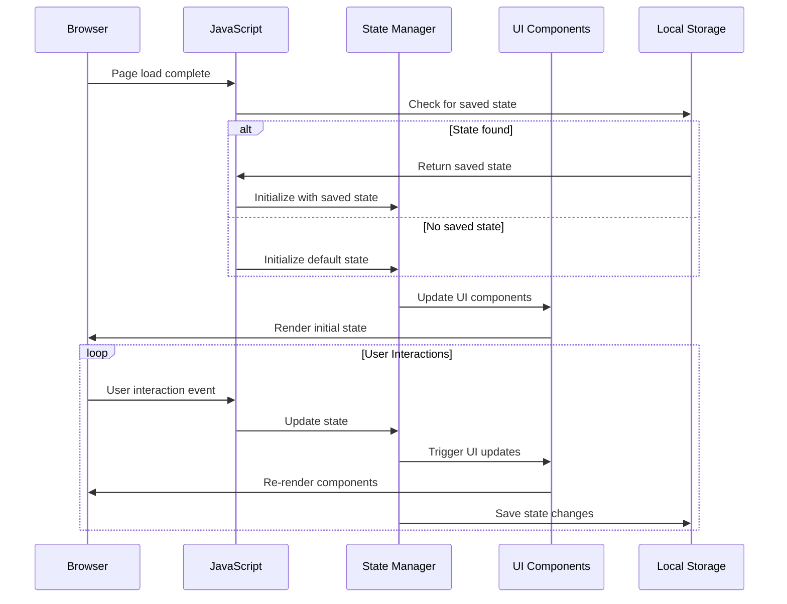
```mermaid
sequenceDiagram
    participant Browser as Browser
    participant JS as JavaScript
    participant State as State Manager
    participant UI as UI Components
    participant Storage as Local Storage
    
    Browser->>JS: Page load complete
    JS->>Storage: Check for saved state
    
    alt State found
        Storage->>JS: Return saved state
        JS->>State: Initialize with saved state
        
    else No saved state
        JS->>State: Initialize default state
    end
    
    State->>UI: Update UI components
    UI->>Browser: Render initial state
    
    loop User Interactions
        Browser->>JS: User interaction event
        JS->>State: Update state
        State->>UI: Trigger UI updates
        UI->>Browser: Re-render components
        State->>Storage: Save state changes
    end
```

### Theme Switching Sequence (if implemented)
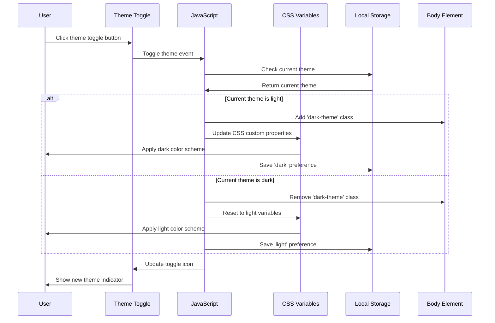
```mermaid
sequenceDiagram
    participant U as User
    participant Toggle as Theme Toggle
    participant JS as JavaScript
    participant CSS as CSS Variables
    participant Storage as Local Storage
    participant Body as Body Element
    
    U->>Toggle: Click theme toggle button
    Toggle->>JS: Toggle theme event
    
    JS->>Storage: Check current theme
    Storage->>JS: Return current theme
    
    alt Current theme is light
        JS->>Body: Add 'dark-theme' class
        JS->>CSS: Update CSS custom properties
        CSS->>U: Apply dark color scheme
        JS->>Storage: Save 'dark' preference
        
    else Current theme is dark
        JS->>Body: Remove 'dark-theme' class
        JS->>CSS: Reset to light variables
        CSS->>U: Apply light color scheme
        JS->>Storage: Save 'light' preference
    end
    
    JS->>Toggle: Update toggle icon
    Toggle->>U: Show new theme indicator
```

## 📊 Performance Monitoring Sequences

### Page Performance Tracking
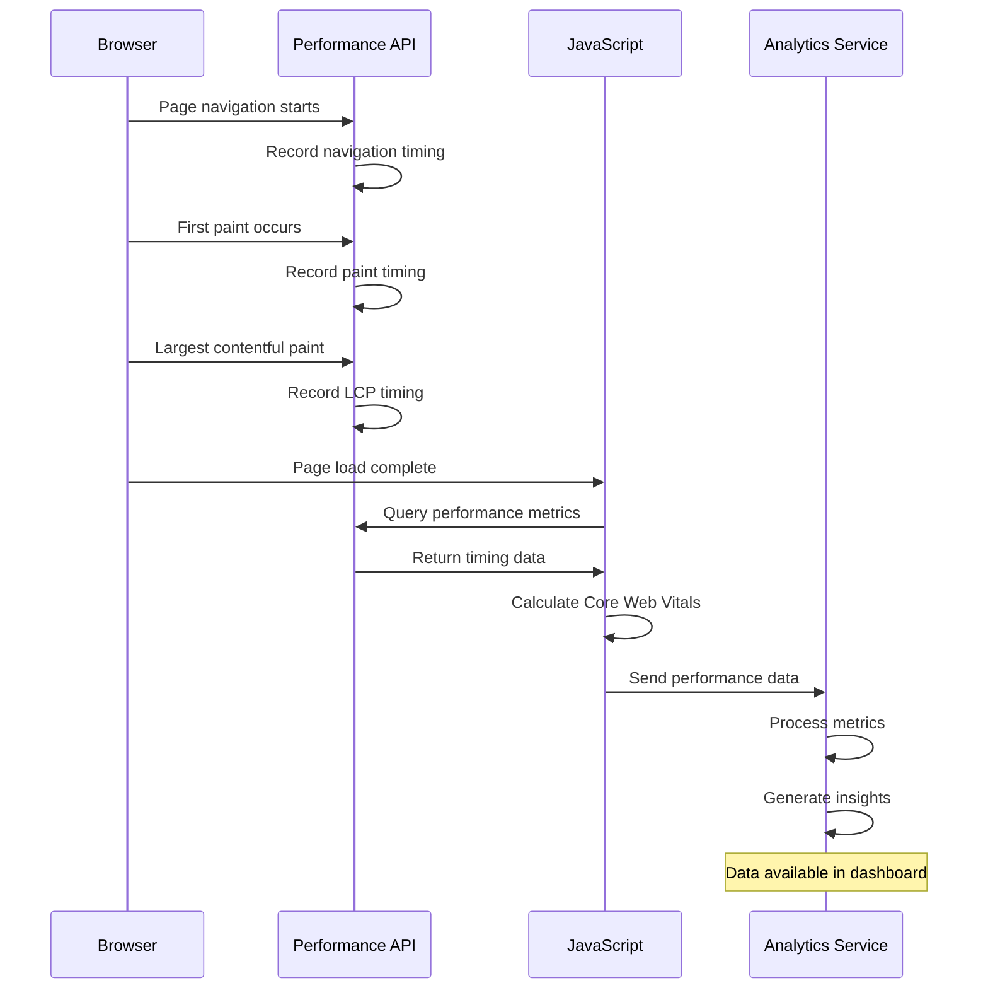
```mermaid
sequenceDiagram
    participant Browser as Browser
    participant Perf as Performance API
    participant JS as JavaScript
    participant Analytics as Analytics Service
    
    Browser->>Perf: Page navigation starts
    Perf->>Perf: Record navigation timing
    
    Browser->>Perf: First paint occurs
    Perf->>Perf: Record paint timing
    
    Browser->>Perf: Largest contentful paint
    Perf->>Perf: Record LCP timing
    
    Browser->>JS: Page load complete
    JS->>Perf: Query performance metrics
    Perf->>JS: Return timing data
    
    JS->>JS: Calculate Core Web Vitals
    JS->>Analytics: Send performance data
    
    Analytics->>Analytics: Process metrics
    Analytics->>Analytics: Generate insights
    
    Note over Analytics: Data available in dashboard
```

## 🚨 Error Handling Sequences

### JavaScript Error Handling
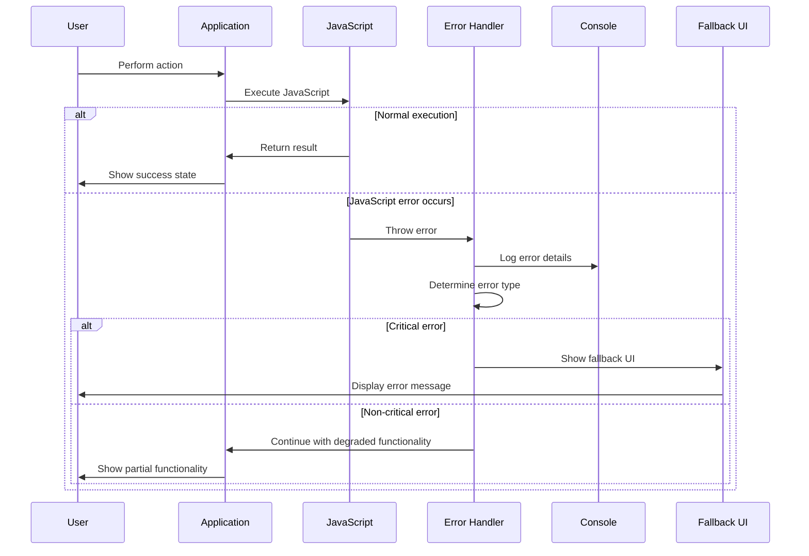
```mermaid
sequenceDiagram
    participant U as User
    participant App as Application
    participant JS as JavaScript
    participant Error as Error Handler
    participant Console as Console
    participant Fallback as Fallback UI
    
    U->>App: Perform action
    App->>JS: Execute JavaScript
    
    alt Normal execution
        JS->>App: Return result
        App->>U: Show success state
        
    else JavaScript error occurs
        JS->>Error: Throw error
        Error->>Console: Log error details
        Error->>Error: Determine error type
        
        alt Critical error
            Error->>Fallback: Show fallback UI
            Fallback->>U: Display error message
            
        else Non-critical error
            Error->>App: Continue with degraded functionality
            App->>U: Show partial functionality
        end
    end
```

---

These sequence diagrams provide a detailed view of how different components interact over time, helping you understand the chronological flow of operations and identify potential optimization points or failure scenarios.